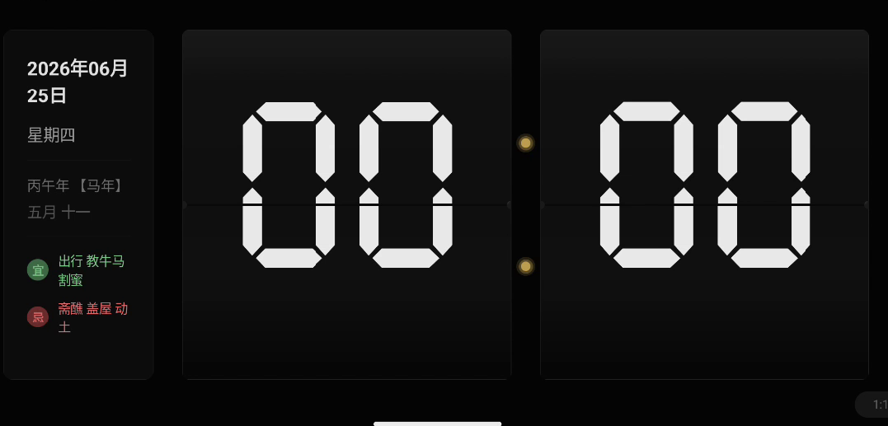

# RetroFlip Clock

**把闲置手机变成一件会翻页的机械艺术品。**


一款专为闲置 Android 手机设计的全屏复古翻页时钟应用。极致拟物化的翻页视觉与听觉体验，纯黑背景适配 OLED 屏幕，完全离线运行。

<!-- 如果有截图，取消注释并放入 docs/ 或 screenshots/ 目录 -->
<!-- <p align="center"></p> -->

## 功能特性

- **翻页动画** — 还原物理翻页时钟的 3D 翻转效果，带 Overshoot 回弹与动态阴影
- **多种显示模式** — 支持 `HH:MM` / `HH:MM:SS`，12 小时制 / 24 小时制自由切换
- **翻页音效** — 清脆的机械 Tick 声，可选低/中/高三档音量
- **万年历** — 公历日期 + 农历（天干地支纪年），完全离线计算（1900–2100 年）
- **OLED 友好** — 纯黑 `#000000` 背景，降低功耗与发热
- **屏幕常亮** — Wake Lock 保持屏幕不休眠，适合桌面/床头使用
- **防烧屏** — 定时像素微偏移，肉眼不可察觉，有效防止 OLED 烧屏
- **亮度调节** — 应用内独立控制屏幕亮度，夜间使用更舒适
- **开机自启** — 可选开机自动启动，开机即用
- **零网络依赖** — 所有功能完全离线，不收集任何数据

## 技术栈

| 层次 | 技术 |
|------|------|
| 语言 | Kotlin |
| UI 框架 | Jetpack Compose + Material 3 |
| 动画 | Compose Animation API + `graphicsLayer` 3D 翻转 |
| 音频 | SoundPool（低延迟短音效） |
| 存储 | DataStore (Preferences) |
| 农历 | [lunar](https://github.com/6tail/lunar) 库（内置数据表，离线计算） |
| 最低版本 | Android 8.0 (API 26) |

## 项目结构

```
app/src/main/
├── AndroidManifest.xml
├── assets/
│   ├── fonts/                  # Ticking Timebomb / Bebas Neue 字体
│   └── sounds/                 # 翻页机械音效 (.wav)
├── java/com/retroflip/clock/
│   ├── MainActivity.kt         # 入口 Activity，屏幕常亮
│   ├── RetroFlipApp.kt         # Application，DataStore 初始化
│   ├── audio/
│   │   └── SoundManager.kt     # SoundPool 音效管理
│   ├── data/
│   │   ├── LunarCalendar.kt    # 农历 / 干支纪年计算
│   │   └── PreferencesManager.kt  # DataStore 设置持久化
│   ├── receiver/
│   │   └── BootReceiver.kt     # 开机自启广播接收器
│   └── ui/
│       ├── ClockScreen.kt      # 主界面（时钟 + 日历 + 设置入口）
│       ├── FlipCard.kt         # 翻页卡片组件（3D 翻转动画）
│       └── SettingsDialog.kt   # 半透明设置面板
└── res/
    ├── font/                   # 内置字体资源
    ├── mipmap-*/               # 应用图标（多分辨率）
    └── values/                 # 颜色、字符串、主题
```

## 构建与运行

### 环境要求

- Android Studio Ladybug (2024.2.1) 或更高版本
- JDK 17+
- Android SDK（compileSdk 34）

### 步骤

```bash
# 克隆仓库
git clone https://github.com/YOUR_USERNAME/RetroFlipClock.git
cd RetroFlipClock

# 用 Android Studio 打开，等待 Gradle 同步完成
# 连接设备或启动模拟器，点击 Run 即可
```

或通过命令行构建 APK：

```bash
# Debug 版本
./gradlew assembleDebug

# Release 版本（需配置签名）
./gradlew assembleRelease
```

> **注意**：首次构建需要配置 `local.properties` 中的 `sdk.dir` 路径（Android Studio 会自动生成）。

## 权限说明

| 权限 | 用途 |
|------|------|
| `WAKE_LOCK` | 保持屏幕常亮 |
| `RECEIVE_BOOT_COMPLETED` | 开机自启（用户可选开启） |

不请求网络权限，不收集任何用户数据。

## 版本规划

- **v1.0** — 翻页时钟核心（翻页动画、12/24h、音效、屏幕常亮） ✅
- **v1.1** — 万年历 + 设置面板（农历、DataStore 持久化） ✅
- **v1.2** — 增强体验（防烧屏、亮度调节、开机自启） ✅

## 许可证

本项目仅供学习与个人使用。

字体 Ticking Timebomb 与 Bebas Neue 遵循其各自的开源/免费授权协议。
音效素材遵循其原始授权协议。
